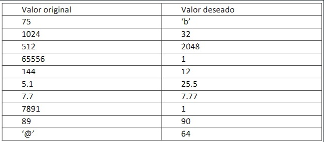

[`Introducción al desarrollo de software`](../../../README.md) > [`Módulo 3`](../../README.md) > [`Sesión 3`](../README.md) > `Reto 1`

## Reto 1: Obten los valores deseados

### 1. Objetivos :dart:

- Conocer cada uno de los operadores existentes en C

### 2. Requisitos :clipboard:

1. Tener acceso a una terminal de Linux
2. Haber configurado previamente el entorno de desarrollo

### 3. Desarrollo

- Crea un archivo llamado Reto_operadores.c
- Crea una variable adecuada para cada renglón de "valor original"
- Con un operador modifica el valor
- *IMPORTATNE* No se pueden repetir operadores

[`Anterior`](../README.md) 

