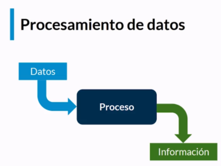

[`Introducción al desarrollo de software`](../../README.md) > [`Módulo 2`](../README.md) > `Sesión 2` 

## Sesión 2: Primeros pasos por la terminal

### 1. Objetivos :dart:

 - Conocer nuevas funcionalidades de la terminal
 - Aprender a gestionar y administrar los procesos de esta misma
 - Monitoreo de los recursos del sistema

### 2. Contenido :blue_book:

 ---

 #### <ins> Flujo estándar </ins>

  

*Procesamiento de datos*

Este es el esquema más básico de cualquier procesamiento de datos. Uno donde ingresamos datos y a través de un proceso recibimos información.

Los canales por donde ingresa la información son conocidos como flujos, de los cuales cualquier consola al menos conoce de 3:
- Entrada estándar 
- Salida estándar
- Error estándar

De forma regular casi siempre el flujo de la información corre desde los periféricos de entrada (el teclado), este le lleva información a la cpu, la cual la procesa y genera una salida por medio de la pantalla, sin embargo la información que le ingresamos no siempre puede venir del teclado, si no también de un archivo de texto al que la computadora tenga acceso.

A su vez se puede hacer el proceso inverso. En vez de que a la salida obtengamos información en la pantalla es posible que esta sea almacenada en algún archivo.

Esto lo podemos hacer con el siguiente comando:

__ls <ruta del archivo-directorio>__

En este caso ejecutará el comando ls, solo que en vez de mostrarnos los datos por pantalla los almacenará en el archivo al que le hemos indicado.

Una variante de esto es adicionar una > en el comando, y lo que hará es agregar al final del archivo indicado lo que debería arrojar en pantalla el comando que hemos especificado, como se verá en el siguiente ejemplo:

-- cat archivo.txt  
-- Contenido del arcivo

-- ls -a  
-- archivo.txt

-- ls -a >> archivo.txt   
-- cat archivo.txt

-- Contenido del archivo  
-- archivo.txt

Y en caso de que la salida de un proceso es la entrada de otro, y así muchas veces, podríamos hacerlo de forma manual, sin embargo esto es bastante tardado e ineficiente, por otra parte podemos hacerlo de forma automática, lo cual facilita la ejecución de varios procesos, para esto nosotros ocupamos pipes o tuberías.( __| ← Este es el símbolo de pipe__), como lo veremos en el siguiente ejemplo:

__Sin pipe__  

-- touch fecha.txt  
-- date > fecha.txt 
-- cat fecha.txt 
-- Wed Oct 28 05:40:36 CST 2020  

__Con pipe__  

-- nano fecha.txt | date > fecha.txt | cat fecha.txt 
-- Wed Oct 28 05:40:36 CST 2020

- [**`Reto 1`**](Reto-01/README.md)

--- 

#### <ins> Procesos </ins>

*Procesos en segundo plano*

Hasta el momento hemos lanzado únicamente procesos en primer plano, sin embargo podemos tener varios procesos ejecutándose de forma paralela 
 
Para esto nosotros tenemos que ocupar un & al final del proceso para que este sea ejecutado en segundo plano, como se verá en el siguiente ejemplo:

-- sudo apt update -y &

De igual forma podemos ejecutar un proceso en primer plano y después mandarlo hacia el segundo plano con  Ctrl + z, y con el comando fg lo podemos traer de regreso al primer plano.

Por otra parte en caso de que nosotros queramos ver los procesos del sistema podemos ocupar __ps__ y __top__. 

En el caso de __ps__ solo con teclearlo nos muestra los procesos que están dentro del sistema y también tenemos algunos modificadores como lo son:
- Para ver todos los procesos del sistema ocupando sintaxis standard:
1. ps -e
2. ps -ef
3. ps -eF
4. ps -ely

- Para ver todos los procesos ocupando la sintaxis BSD
1. ps ax
2. ps axu

- Para imprimir el árbol de procesos:
1. ps -ejh
2. ps axms

- Para obtener información acerca de los hilos
1. ps -eLf
2. ps axms

Por otra parte tenemos __top__, el cual a diferencia de ps, este es un proceso interactivo y no estático, por lo tanto se está actualizando de manera constante en la terminal

En caso de que queramos detener algún proceso tenemos varias alternativas. En caso de que este se esté ejecutando en primer plano únicamente podremos hacer __Ctrl + c__ y esto detendrá cualquier proceso. Por otra parte si queremos detener un proceso que se está ejecutando en segundo plano podemos ocupar los comandos __kill__ y __killall__.
El comando kill -9 <número de proceso> significa que el proceso tendrá que terminarse de manera inmediata. En el caso del comando killall es exactamente lo mismo, su única diferencia con respecto a kill es la forma en la que indicamos que proceso terminar, en este casi es así killall -9 python3 loop.py 

--- 

[`Anterior`](../Ejemplo-02/README.md) 

 
