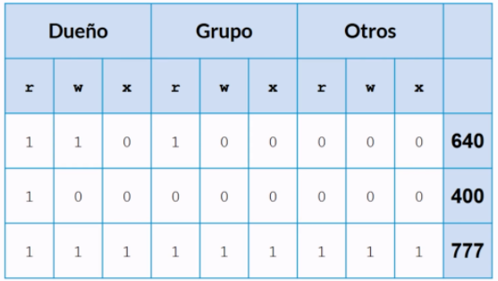

[`Introducción al desarrollo de software`](../../README.md) > [`Módulo 2`](../README.md) > `Sesión 3` 

## Sesión 3: Manejo de paquetes y permisos sobre los archivos

### 1. Objetivos :dart:

 - Aprendes a manejar permisos sobre archivos
 - Saber cómo actualizar dependencias y descargar paquetes
 - Tener las bases sobre cómo sustentar un sistema basado en Unix

### 2. Contenido :blue_book:

 ---

 #### <ins> Permiso sobre archivos </ins>

Desde los comienzos de Unix se ha pensado que este sea un sistema multiusuarios, por lo que para tener acceso a diversos archivos siempre tenemos 3 tipos de usuarios con respecto a un archivo.
El primer tipo de usuarios es el dueño del archivo, el cual creó algún archivo y cuenta con todos los privilegios (lectura, escritura y ejecución), el segundo tipo de usuarios es un grupo de personas el cual pueden contar con algunos privilegios otorgados por el dueño.Por último tenemos a aquellos usuarios que no pertenecen a ninguno de estos dos, que de igual forma cuentan con aquellos permisos que les ha autorizado el dueño, que por lo regular son nulos.

A Través del comando *ls -l* podemos acceder a esta información

Como podemos observar en la imagen:
En este caso tomaremos como ejemplo la última línea: *-rw-r--r--*
Los primeros tres caracteres (*rw-*) corresponden al dueño, lo cual significa que tiene permiso de leer, escribir, pero no de ejecutarlo (lo más probable es que no sea un archivo ejecutable).
Los siguientes 3 (*r--*) corresponden al grupo de usuarios seleccionados, y estos solo pueden hacer lectura del archivo, y en este caso los últimos 3 que corresponden a los demás usuarios tienen los mismos privilegios.
No aparece pero la x significa ejecución.

Para alterar los permisos de los archivos tenemos 3 comandos:
- *chmod* → Este comando cambio individualmente los permisos
- *chown* → Este comando cambia el dueño del archivo
- *chgrp* → Y este módifica el grupo de usuarios con permisos especiales 

*chmod:*
Con el atributo o nos referimos a los demás usuarios, si no ponemos nada para indicar le da a todos el permiso
con el signo - decimos que estamos retirando un permiso, por el contrario con el signo más le damos +

Como se observa en el siguiente ejemplo:

>> *chmod o-w nuevo.txt*
En este caso nosotros estamos quitando a los demás usuarios el permiso 

Todo lo que vimos de forma anterior es la llamada notación textual, sin embargo es más común ver la notación binaria la cual se expresa en una matriz, la cual bien se puede expresar en  números decimales enteros de 3 dígitos.

La matriz que forma se puede ver ejemplificada en la siguiente imagen:

De forma ejemplificada si nosotros queremos darle al dueño todos los permisos, que el grupo de usuarios con privilegios puedan leer y escribir, y que los demás usuarios no tengan ningún permiso podría verse de esta forma:

0b 111 110 000 = 760

Por lo tanto si ejecutamos el comando: 

>> *chmod 760 ejemplo.py*

- [**`Reto 1`**](Reto-01/README.md)

Los permisos quedarán algo así: -rwxrw----

--- 

#### <ins>Manejo de paquetes</ins>

En caso de que queramos instalar paquetes en nuestra computadora, necesitamos un administrador de paquetes, que es el que se encarga de resolver los problemas de dependencias. 
Dentro del mundo de linux existen varios manejadores de paquetes como apt, zypper, pacman o rpm.

Lynx es un navegador a través de terminal 

--

[`Anterior`](../Sesion-02/README.md) | [`Anterior`](../Sesion-04/README.md) 

 
