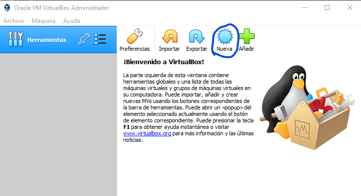
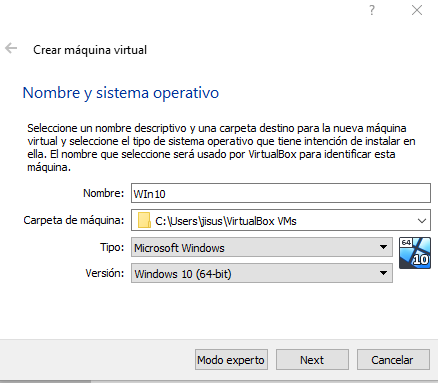
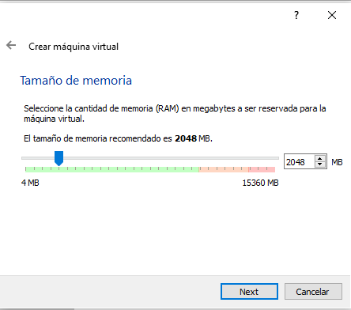
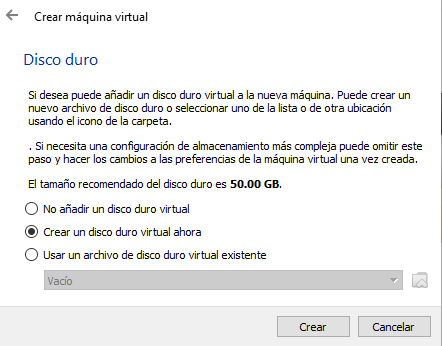
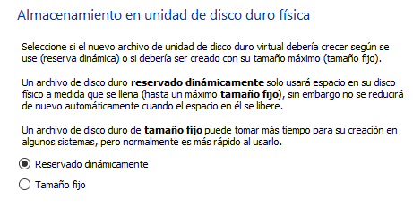
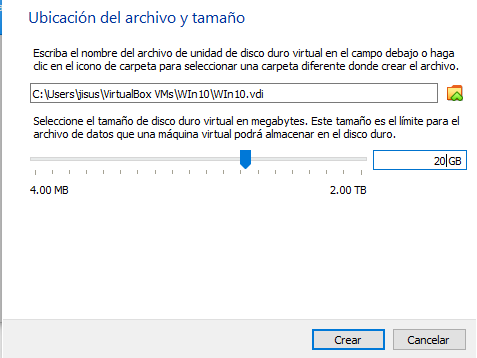
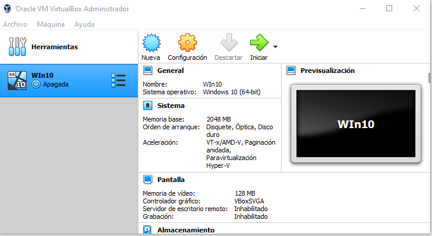
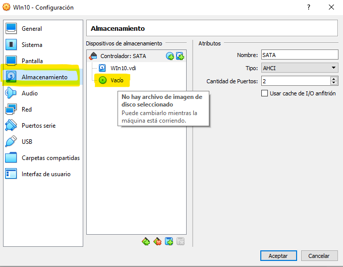
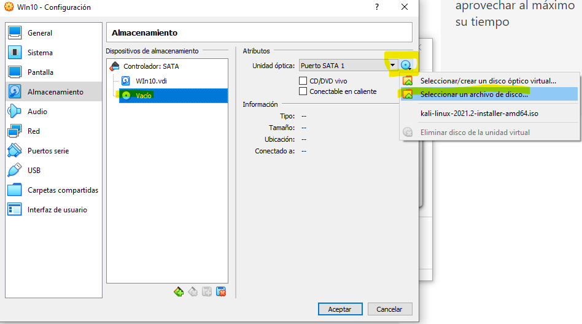

[`Introducción al desarrollo de software`](../../../README.md) > [`Módulo 1`](../../README.md) > [`Sesión 1`](../README.md) > `Ejemplo 1`

## Ejemplo 1: Instalación de Windows 10 

### 1. Objetivos :dart:

- Instalar Windows 10 dentro de una Máquina Virtual

### 2. Requisitos :clipboard:

1. Tener [`Oracle Virtual Box`](https://www.virtualbox.org/) instalado 
2. Descargar la ISO de [`Windows 10`](https://www.microsoft.com/es-es/evalcenter/evaluate-windows-10-enterprise) (Instrucciones más abajo)
3. Tener acceso a una cuenta de  

### 3. Desarrollo :rocket:

1. Descargaremos la ISO de Windows 10 accediendo al siguiente [`link`](https://www.microsoft.com/es-es/evalcenter/evaluate-windows-10-enterprise)

- Dentro del link seleccionamo la opción *ISO - Enterprise* y damos en Continuar

 

- Rellenamos __TODOS__ los campos dentro del formulario, no necesariamente tiene que ser información real y presionamos continuar.

 

- Seleccionamos la opción de 32 o 64 bits según sea [`nuestro sistema`](https://es.ccm.net/faq/9548-como-saber-si-mi-windows-es-de-32-o-64-bits), escogemos el idioma deseado y presionamos descargar.

 

---

2. Abrimos Virtual Box y presionamos en *NUEVA*

 

---

3. Introducimos el nombre de *Win10*, seleccionamos la ubicación donde queremos que se almacenen los datos de la máquina, en tipo seleccionamos *Microsoft Windows* y en versión seleccionamos *Windows 10* 64 o 32 bits según sea tu caso y damos siguiente.

 

---

4. Seleccionamos la cantidad de memoria RAM que le queremos designar a la máquina, esta puede variar según el sistema operativo y el equipo, sin embargo lo __mínimo son 2GB__ (lo que viene por defecto), podemos agregar más sí así lo deseamos y __nuestro equipo lo permite__.

 

---

5. Seleccionamos la opción de crear un disco duro virtual ahora y presionamos crear.

 

---
6. Seleccionamos la opción de __VDI__ y presionamos Next

 

---

7. Seleccionamos la opción de reservado dinámicamente y presionamos siguiente.

 

---

8. Posteriormente seleccionamos la cantidad máxima de disco que podrá contener nuestra máquina virtual, en este caso la cantidad mínima de disco son 20GB para 64 bits o 16GB para 32 bits y presionamos crear.

 

---

9. Una vez estemos en la siguente pantalla debemos de presionar el engrane que dice __CONFIGURACIÓN__.

 

10. En el menú lateral presionamos Almacenamiento, y luego hacemos click sobre el disco que dice __vacío__

 

---

11. Una vez presionado Vació nos desplegrá un nuevo menú a la derecha, ahí debemos de buscar el __ícono del disco azul__ y ahí presionar la opción __seleccionar archivo de disco__. Dentro de ese explorador de archivos debemos de seleccionar el archivo ISO de Win10 que descargamos anteriormente.

 

---

12. Una vez realizado el paso anterior, en el menú lateral nos dirigimos al apartado de Red, y nos sercioramos que este seleccionada la casilla *Habilitar adaptador de red* y que dentro de la opción __conectado a__ aparezca *NAT*. Una vez esto configurado presionamos aceptar.

 

---

#### __¡Listo, ya has montado una máquina virtual!__ ahora solo es necesario seguir el [`proceso de intalación`](https://www.softzone.es/instalar-windows-10-manual-e-instalacion-paso-paso/) común de Windows 10.

[`Anterior`](../README.md) | [`Siguiente`](../Ejemplo-02/README.md)

