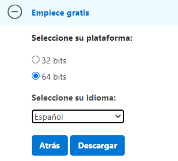

[`Introducción al desarrollo de software`](../../../README.md) > [`Módulo 1`](../../README.md) > [`Sesión 1`](../README.md) > `Ejemplo 1`

## Ejemplo 1: Instalación de Windows 10 

### 1. Objetivos :dart:

- Instalar Windows 10 dentro de una Máquina Virtual

### 2. Requisitos :clipboard:

1. Tener [`Oracle Virtual Box`](https://www.virtualbox.org/) instalado 
2. Descargar la ISO de [`Windows 10`](https://www.microsoft.com/es-es/evalcenter/evaluate-windows-10-enterprise) (Instrucciones más abajo)

### 3. Desarrollo :rocket:

1. Descargaremos la ISO de Windows 10 accediendo al siguiente [`link`](https://www.microsoft.com/es-es/evalcenter/evaluate-windows-10-enterprise)

- Dentro del link seleccionamo la opción *ISO - Enterprise* y damos en Continuar

- Rellenamos __TODOS__ los campos dentro del formulario, no necesariamente tiene que ser información real y presionamos continuar.

- Seleccionamos la opción de 32 o 64 bits según sea [`nuestro sistema`](https://es.ccm.net/faq/9548-como-saber-si-mi-windows-es-de-32-o-64-bits), escogemos el idioma deseado y presionamos descargar.

