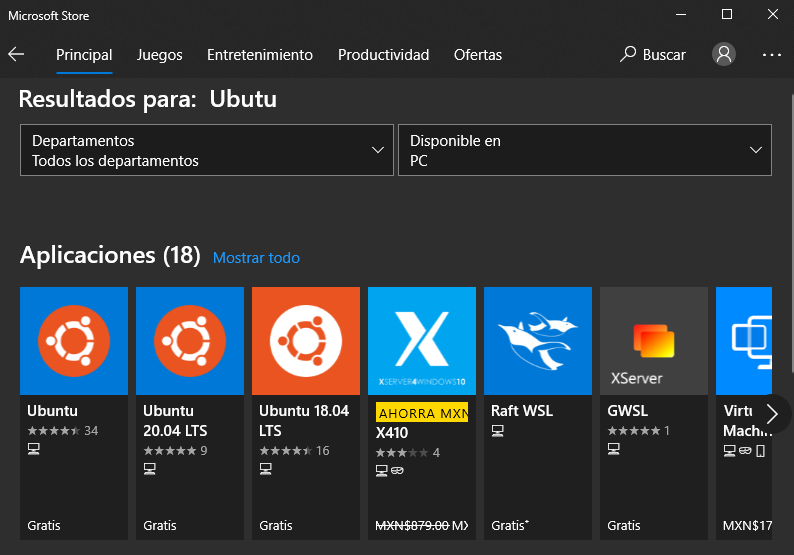

[`Introducción al desarrollo de software`](../../README.md) > [`Módulo 1`](..README.md) > `Sesión 2` 

## Sesión 2: Subsistema de Windows para Linux 

### 1. Objetivos :dart:

 - Instalar WSL dentro de nuestro Windows.
 - Hacer las coniguraciones necesarias para tener WSL en nuestro equipo.

### 2. Requisitos :clipboard:

1. Tener acivada la opción de virtualización dentro de nuestras computadoras.

2. Tener acceso al PowerShell como administrador. 

### 3. Desarrollo :blue_book:

1. Abrir el Power Shell como administrador

---

2. Habilitar el Subsitema de Windows para linux

*dism.exe /online /enable-feature /featurename:Microsoft-Windows-Subsystem-Linux /all /norestart*

---

3. Habilitar las características de máquina virtual

*dism.exe /online /enable-feature /featurename:VirtualMachinePlatform /all /norestart*

---

4. Descargar [`el paquete de actualización del Kernel de Linux`](https://wslstorestorage.blob.core.windows.net/wslblob/wsl_update_x64.msi)

---

5. Definir WSL como versión predeterminada

*wsl --set-default-version 2*

---

6. Instalar la distribución desdeada. Para esto abriremos la *Microsoft Store* en nuestras computadoras y buscaremos *Ubuntu*, ahí seleccionaremos la primera opción y daremos en descargar.

 

---

7. Ahora solo queda configurar nuestro Ubuntu!

---
 
[`Anterior`](../Sesion-01/Reto-01/README.md) | [`Siguiente`](../../Intro-terminal/README.md)

 
